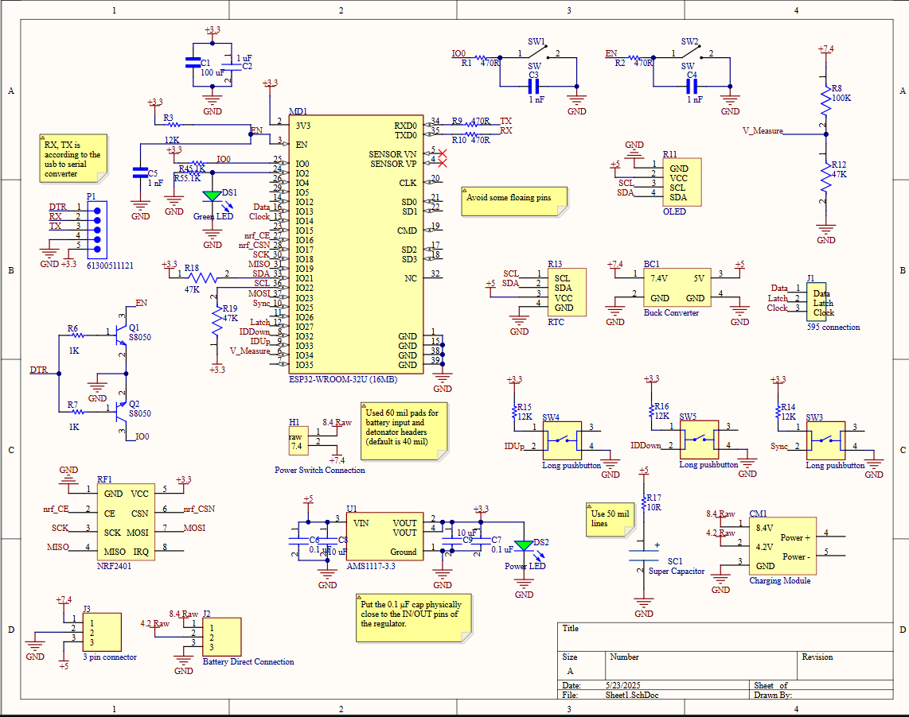
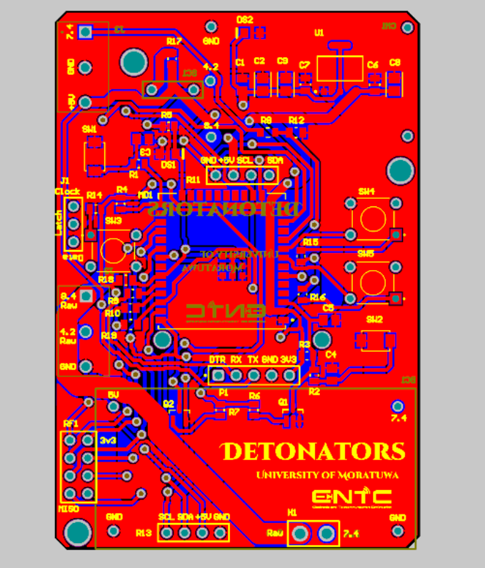
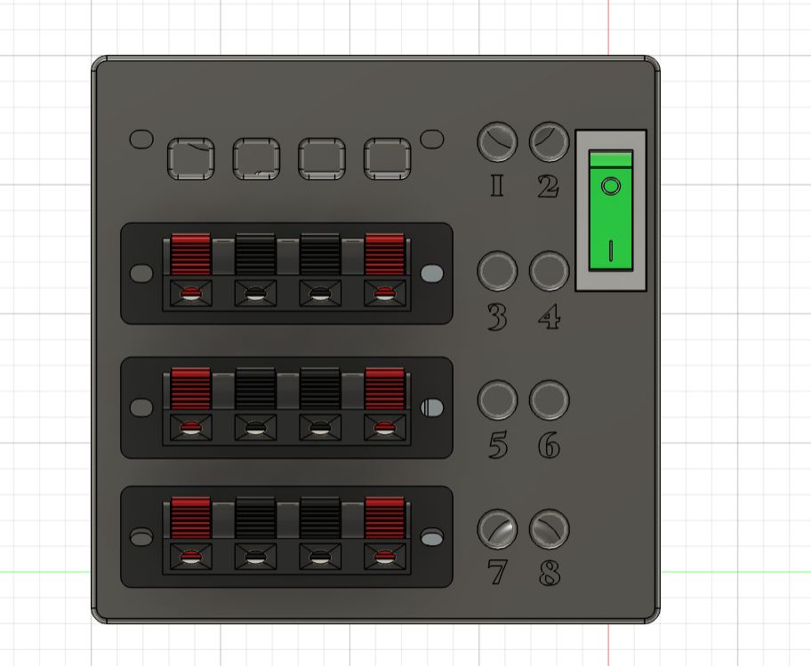
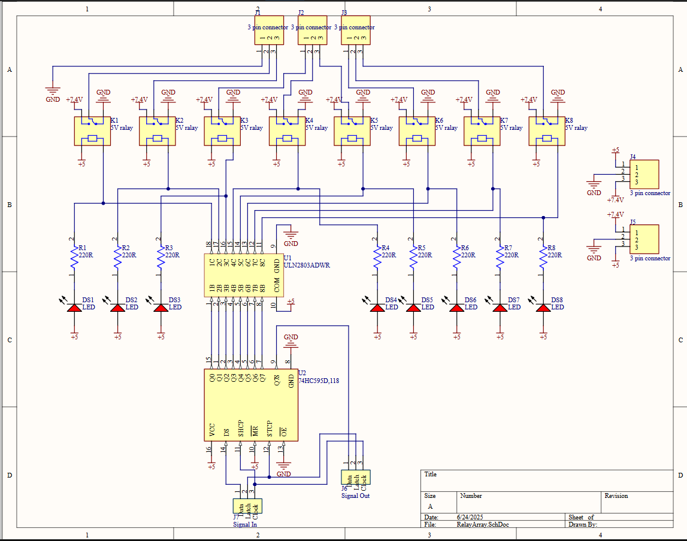
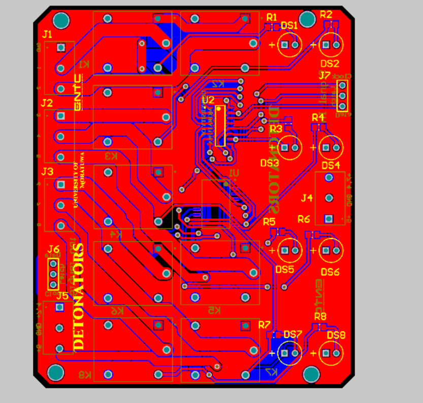
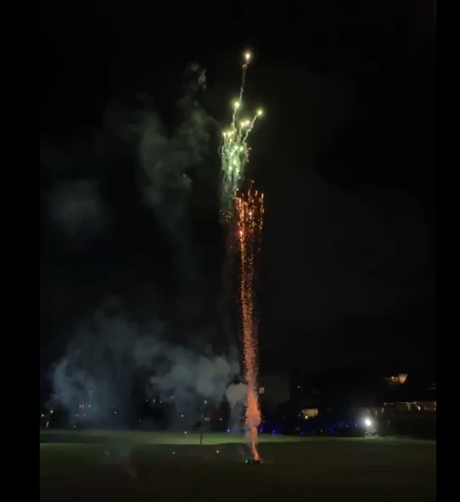
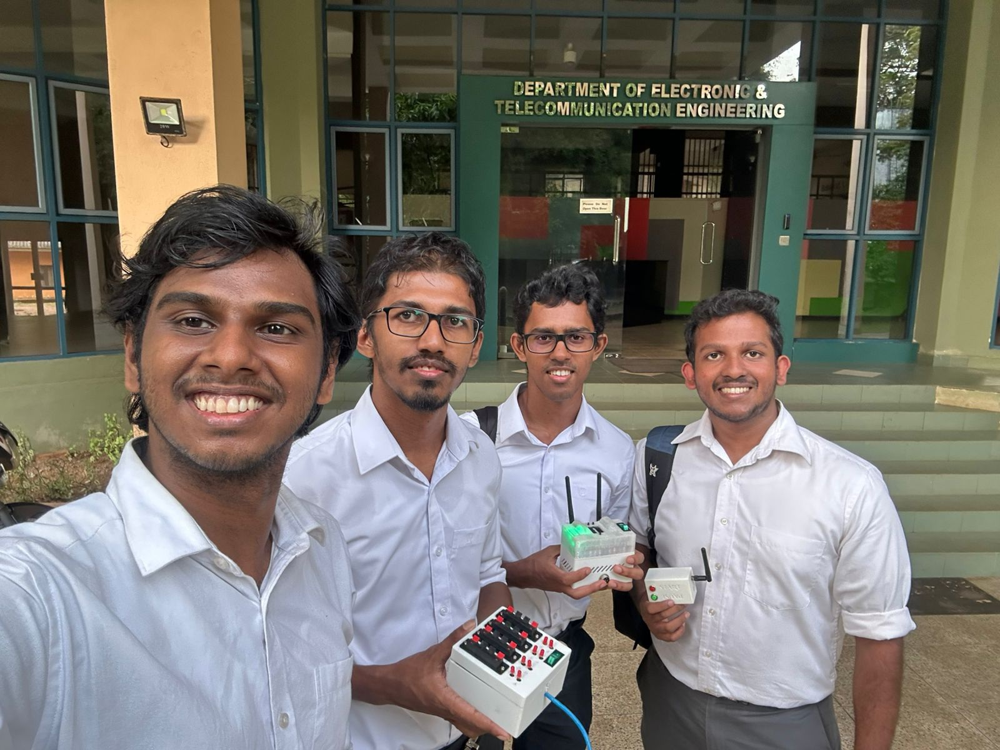

# EDP_Firework_Control_Panel

## Overview
The current market for Firework controllers, specially remote firework controllers is in a financially upper level due to the cost and niche demand. Locally for those who cannot afford the system, manual practive is what is being done quite often, which is risky and require more labour. Hence the Remote Firework Controller is an idea proposed by Team Detonators for firework professionals to make their work more convenient and safe.

## Features
- Wireless ignition via remote.
- Custom or pre-saved pattern based ignition.
- Safety that decouples igniters from power before arming igniters.
- Secure and reliable communication with peer-peer architecture.

## Technical Overview
- ESP32 based controller.
- A Relay cut-off mechanism triggered igniter.
- Powered by rechargable 3.7V Li ion batteries.
- User-friendly mobile application for control.

Controller

Controller Schematic

Controller PCB

Igniter 

Igniter Schematic

Igniter PCB

## Final product and Testing

The final product was tested under the mentorship from Ruhunu Fireworks at the Waters Edge Hotel- Battaramulla, Sri Lanka.

## Team Detonators
  The project is developed and maintained by;
  1. Sithum Peiris [@angstrom10](https://github.com/angstrom10)
  2. Lakindu Gunasekara [@LGsekara1](https://github.com/angstrom10)
  3. Hiruna Kariyawasam [@HirunaK](https://github.com/HirunaK)
  4. Hiviru Palihena [@hivirup](https://github.com/hivirup)

